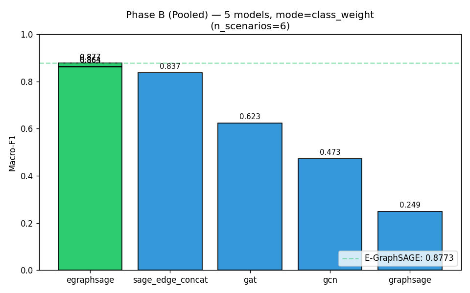
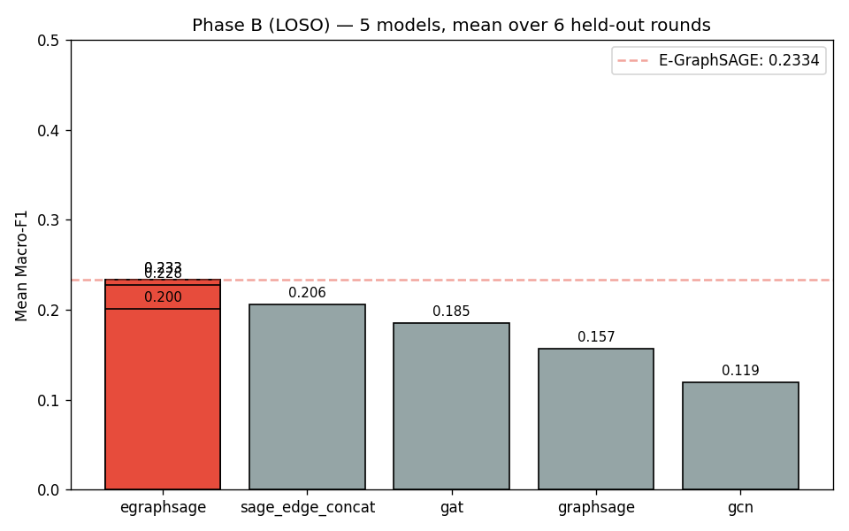
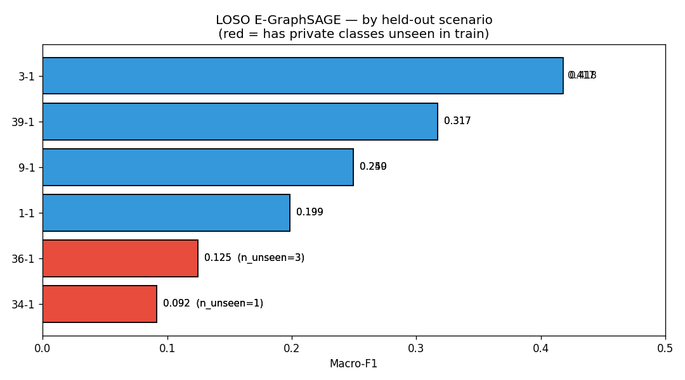
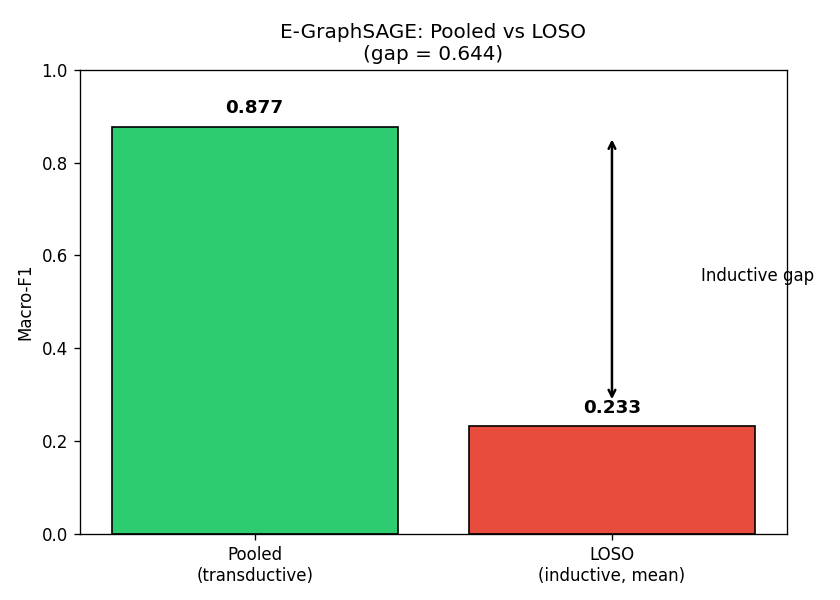

# Báo cáo Kỹ thuật — Giai đoạn 1: Baseline GNN Tập trung

> **Đồ án TTTN nhóm M06** — Nguyễn Khắc Bảo & Nguyễn Chí Hiếu
> *Phát hiện hành vi độc hại trong Kubernetes bằng Federated Learning + GNN trên bộ dữ liệu IoT-23*
>
> Giai đoạn 1 do **Nguyễn Khắc Bảo** phụ trách.
> Kết quả thực nghiệm cuối cùng: `artifacts/phase1_results/results_summary.csv`

---

## 1. Tổng quan

Mục tiêu Giai đoạn 1 là xây dựng **mô hình GNN baseline tập trung** trên toàn bộ dữ liệu IoT-23, làm mốc hiệu năng cơ sở (baseline) để Giai đoạn 2 (Federated Learning) so sánh.

Cụ thể, GĐ1 thực hiện:

- Tiền xử lý raw Zeek conn.log.labeled thành đồ thị IP-flow.
- Xây dựng **E-GraphSAGE** — mô hình chính, tự cài đặt trên `MessagePassing` của PyG.
- Đào tạo 4 baseline đối chứng: GCN, GraphSAGE, sage_edge_concat (Phương án B), GAT-v2.
- Đánh giá theo 3 protocol: **pooled** (tập trung, nền so sánh FL), **LOSO** (leave-one-scenario-out, đo tổng quát hóa), **per_scenario** (smoke test).

Phương pháp chính: **edge classification** (phân loại từng flow = từng cạnh trên đồ thị).

---

## 2. Dữ liệu & Tiền xử lý

### 2.1 Dataset

Bộ dữ liệu IoT-23 v1 (dạng Zeek `conn.log.labeled`), gồm 6 scenario malware đa dạng:

| Scenario | Malware | Ghi chú |
|---|---|---|
| CTU-IoT-34-1 | Mirai | DDoS chiếm đa số |
| CTU-IoT-1-1 | Hide-and-Seek | Port scan chiếm đa số |
| CTU-IoT-3-1 | Muhstik | Port scan chiếm đa số |
| CTU-IoT-9-1 | Linux.Hajime | Port scan chiếm đa số |
| CTU-IoT-36-1 | Okiru | C&C chiếm đa số; chứa lớp Okiru-Attack (3 mẫu) |
| CTU-IoT-39-1 | IRCBot | Port scan chiếm đa số |

Tổng dung lượng 6 file: khoảng 15–20 GB.

### 2.2 Tiền xử lý chính

| Quyết định | Chi tiết |
|---|---|
| Tách cột 21 | `tunnel_parents`, `label`, `detailed-label` tách riêng trước khi xử lý |
| Nhãn | `detailed-label` từ `"-"` / `"(empty)"` → `"Benign"` **trước** khi chuyển `-` → NaN |
| Feature | 55 chiều (feature_dim=55), 8 lớp (num_classes=8) |
| IP | **Chỉ làm node ID** — KHÔNG đưa vào feature (điểm cốt lõi GNN vs ML truyền thống) |
| Cổng đích | Bucketing: well-known / registered / dynamic (không one-hot 65536 giá trị) |
| History | Đếm số lần xuất hiện từng ký tự cờ (`S`, `D`, `F`, `R`, …) — encoding tần suất |
| Numeric | `log1p(x)` trước, rồi `StandardScaler` — phân phối heavy-tailed |
| Service | Điền NaN → `"unknown"` (đã được mã hóa thành one-hot) |
| Mất cân bằng | `class_weight` (weighted CE) hoặc undersampling — KHÔNG dùng SMOTE |

---

## 3. Phương pháp

### 3.1 Mô hình chính: E-GraphSAGE

E-GraphSAGE là mô hình **tự viết** kế thừa `torch_geometric.nn.MessagePassing`:

- **Node feature**: vector hằng (all-ones) — vì thông tin phân biệt nằm ở cạnh, không ở node.
- **Message**: `concat([x_source, edge_attr])` → `Linear` → `ReLU` → đây là chỗ E-GraphSAGE khác GraphSAGE gốc.
- **Update**: `concat([x_original, aggr_out])` → `Linear` → `ReLU`.
- **Edge classification head**: `concat([h_u, h_v, edge_attr_gốc])` → MLP → logits.

Mô hình có 2 E-GraphSAGE layer, hidden_dim=64, dropout=0.5.

### 3.2 Baselines đối chứng — "3 cách dùng đặc trưng cạnh"

| Mô hình | Cách dùng edge_attr | Kỳ vọng |
|---|---|---|
| **E-GraphSAGE** | CONCAT vào message trong mỗi layer | **Mạnh nhất** — edge info tham gia lan truyền |
| **GAT-v2** | Điều chỉnh TRỌNG SỐ attention trên message | Trung bình — edge ảnh hưởng attention weight |
| **sage_edge_concat** | MEAN edge → nén vào node input trước SAGE | Kém hơn E-GraphSAGE (mất locality, mất per-edge) |
| **GraphSAGE** | KHÔNG dùng (chỉ node feature) | Yếu — mù edge hoàn toàn trong MP |
| **GCN** | KHÔNG dùng (chỉ node feature) | Yếu nhất — GCNConv không nhận edge_attr |

Tất cả 5 model dùng chung **edge classification head** để đảm bảo so sánh công bằng — mọi khác biệt đến từ cách xử lý edge feature trong message passing.

### 3.3 Protocol đánh giá

| Protocol | Ý nghĩa | Mode split |
|---|---|---|
| **pooled** | Gộp 6 scenario → 1 đồ thị lớn. Train+eval trên cùng đồ thị. | Transductive (70/10/20 edge masks) |
| **per_scenario** | Mỗi scenario riêng biệt. | Transductive |
| **LOSO** | 5 scenario train, 1 held-out để test. | Inductive (6 rounds) |

**pooled** chính là "mô hình tập trung" — kết quả này sẽ được so sánh trực tiếp với FL ở GĐ2.
**LOSO** đo khả năng **tổng quát hóa sang mạng mới** — khắc nghiệt nhất.

---

## 4. Kết quả thực nghiệm

> **Lưu ý**: per_scenario chỉ chạy smoke-test (2 scenario, 20 epoch) nên **không đưa vào báo cáo**. Tất cả số liệu dưới đây là kết quả **full run** trên vast.ai GPU.

### 4.1 Pooled Phase A — Chọn imbalance mode

E-GraphSAGE trên pooled graph, so sánh 3 imbalance mode:

| Imbalance mode | macro-F1 | weighted-F1 | Accuracy | Best epoch |
|---|---|---|---|---|
| none | 0.8643 | 0.9851 | 0.9851 | 150 |
| **class_weight** | **0.8773** | 0.9842 | 0.9840 | 88 |
| undersample | 0.8626 | 0.9805 | 0.9805 | 105 |

**→ class_weight thắng** (macro-F1 cao nhất, hội tụ nhanh nhất — 88 epoch vs 150 epoch).

### 4.2 Pooled Phase B — So sánh 5 models (mode = class_weight)

| Model | macro-F1 | weighted-F1 | Accuracy | Best epoch | Ghi chú |
|---|---|---|---|---|---|
| **E-GraphSAGE** | **0.8773** | 0.9842 | 0.9840 | 88 | Winner |
| sage_edge_concat | 0.8371 | 0.9675 | 0.9674 | 47 | ablation "gần đúng" |
| GAT | 0.6229 | 0.7681 | 0.8086 | 119 | attention nhưng yếu hơn |
| GCN | 0.4730 | 0.4679 | 0.5862 | 35 | mù edge trong MP |
| GraphSAGE | 0.2489 | 0.4450 | 0.5419 | 35 | mù edge trong MP |

→ **E-GraphSAGE thắng lớn** ở pooled: 0.8773 so với 0.8371 (sage_edge_concat) — xác nhận rằng ghép edge vào message hiệu quả hơn nén edge vào node input.

### 4.3 LOSO Phase B — So sánh 5 models (mode = none)

Mean macro-F1 qua 6 rounds held-out:

| Model | mean macro-F1 | mean best epoch |
|---|---|---|
| **E-GraphSAGE** | **0.2334** | 117 |
| sage_edge_concat | 0.2055 | 96 |
| GAT | 0.1853 | 69 |
| GraphSAGE | 0.1567 | 54 |
| GCN | 0.1190 | 39 |

→ E-GraphSAGE **vẫn thắng ở LOSO** — nhưng khoảng cách giảm đáng kể.

### 4.4 LOSO theo từng scenario held-out (E-GraphSAGE, mode = none)

| Held-out | macro-F1 | n_unseen | Phân tích |
|---|---|---|---|
| **3-1** (Muhstik) | **0.4182** | 0 | Scenario tốt nhất — các lớp đều xuất hiện ở các scenario khác |
| 39-1 (IRCBot) | 0.3173 | 0 | F1_C&C=0.052 do C&C phân bố lệch giữa 39-1 và các scenario khác |
| 9-1 (Linux.Hajime) | 0.2495 | 0 | Chỉ có Benign+PortScan; model tốt ở Benign (0.9962) |
| 1-1 (Hide-and-Seek) | 0.1987 | 0 | F1_PortScan=0.650 (mất lớp C&C, DDoS, Attack) |
| 36-1 (Okiru) | 0.1248 | **3** | **3 lớp private** không xuất hiện ở scenario khác → F1=0 |
| **34-1** (Mirai) | **0.0916** | **1** | **1 lớp private** (DDoS) cực lớn → model gần như mù |

**Nguyên nhân LOSO thấp chủ yếu do giới hạn dữ liệu:**

- **34-1** (macro-F1 = 0.092): Mirai tạo ra lớp DDoS **chỉ xuất hiện ở 34-1** (14,394 mẫu trong test, 0 trong train). Khi 34-1 bị held-out, model hoàn toàn không nhận ra DDoS → F1_DDoS = 0.00.
- **36-1** (macro-F1 = 0.125): Gồm 3 lớp private: Okiru-Attack (3 mẫu), Okiru (20,000 mẫu), C&C (15,688 mẫu). Khi 36-1 bị held-out, model không học được Okiru hay Okiru-Attack → F1 = 0 cho cả 2.

→ **Đây không phải lỗi model** — mà là giới hạn cố hữu khi test trên mạng chưa từng thấy. Phát hiện này có ý nghĩa trực tiếp cho GĐ2: FL sẽ gặp phải vấn đề tương tự nếu các client có phân bố nhãn lệch.

---

## 5. Phân tích & Phát hiện chính

### 5.1 E-GraphSAGE nhất quán thắng

Ở cả pooled (0.8773) lẫn LOSO (0.2334 mean macro-F1), E-GraphSAGE đều xếp hạng nhất trong 5 model. Điều này xác nhận giả thuyết: **đặc trưng cạnh (edge feature) trong message passing mang lại thông tin phân biệt mà GCN/GraphSAGE gốc không khai thác được.**

### 5.2 Khoảng cách lớn giữa pooled và LOSO

| Protocol | E-GraphSAGE macro-F1 |
|---|---|
| Pooled (transductive) | 0.8773 |
| LOSO (inductive) | 0.2334 |
| **Khoảng cách** | **0.6439** |

Khoảng cách này rất lớn và phản ánh thực tế: mô hình rất mạnh khi được test trên chính đồ thị nó đã train (transductive), nhưng yếu đi rõ rệt khi phải áp dụng lên mạng chưa từng thấy (inductive). Đây là **phát hiện trọng tâm** của GĐ1.

Nguyên nhân: IoT-23 có phân bố nhãn **lệch giữa các scenario** — mỗi loại malware tạo ra các lớp hành vi riêng mà các scenario khác không có. FL ở GĐ2 sẽ phải giải quyết đúng bài toán này (non-IID data across clients).

### 5.3 Lớp Okiru-Attack (3 mẫu) gần như không học được

Lớp Okiru-Attack chỉ có **3 mẫu** trong toàn bộ dataset (chỉ ở 36-1). Ở mọi cấu hình, F1 = 0.0 cho lớp này. Đây là giới hạn dữ liệu thực tế — không thể học được từ 3 mẫu, và khi 36-1 bị held-out trong LOSO, lớp này hoàn toàn không xuất hiện trong train.

→ Ghi nhận trung thực: lớp cực hiếm này sẽ luôn là thách thức cho cả centralized GNN lẫn FL.

### 5.4 sage_edge_concat là ablation hợp lý

sage_edge_concat (Phương án B) xếp nhì ở cả pooled (0.8371) lẫn LOSO (0.2055). Kết quả xác nhận: **nhồi edge vào node input (mean → concat) tốt hơn bỏ qua edge (GCN/GraphSAGE), nhưng kém hơn concat edge vào message (E-GraphSAGE)** — vì mất locality và mất per-edge distinction.

### 5.5 Class_weight hiệu quả nhất

Class_weight luôn cho macro-F1 cao nhất và hội tụ nhanh nhất (best_epoch = 88 trên pooled). Undersample gần như bằng nhưng hội tụ chậm hơn (105 epoch). Mode none đạt 0.8643 nhưng hội tụ chậm nhất (150 epoch — chạm max).

---

## 6. Hạn chế & Hướng khắc phục

| Hạn chế | Giải thích | Hướng khắc phục |
|---|---|---|
| per_scenario chưa chạy full | Chỉ có smoke-test 2 scenario, 20 epoch | Chạy lại với `--protocols per_scenario` trên vast.ai |
| Lớp Okiru-Attack (3 mẫu) | F1 = 0.0 mọi cấu hình | Cần thêm dữ liệu hoặc gộp vào lớp cha (Okiru) |
| LOSO khắc nghiệt | macro-F1 ~0.23 do phân bố nhãn lệch giữa scenarios | FL có thể cải thiện bằng communication rounds; đây là motivator cho GĐ2 |
| GAT yếu hơn kỳ vọng | macro-F1 = 0.623 (pooled), 0.185 (LOSO) | Có thể do attention mechanism overfit trên đồ thị có cấu trúc đơn giản |
| Feature_dim = 55 | Số lượng feature trung bình, không có embedding sâu cho history/conn_state | Cân nhắc learning-based encoding cho categorical ở GĐ3 |

---

*Báo cáo này dựa trên kết quả thực nghiệm cuối cùng: `artifacts/phase1_results/results_summary.csv`*
*Model chính: `src/model.py` (EGraphSAGE), chạy trên vast.ai GPU (RTX 3090/4090)*
